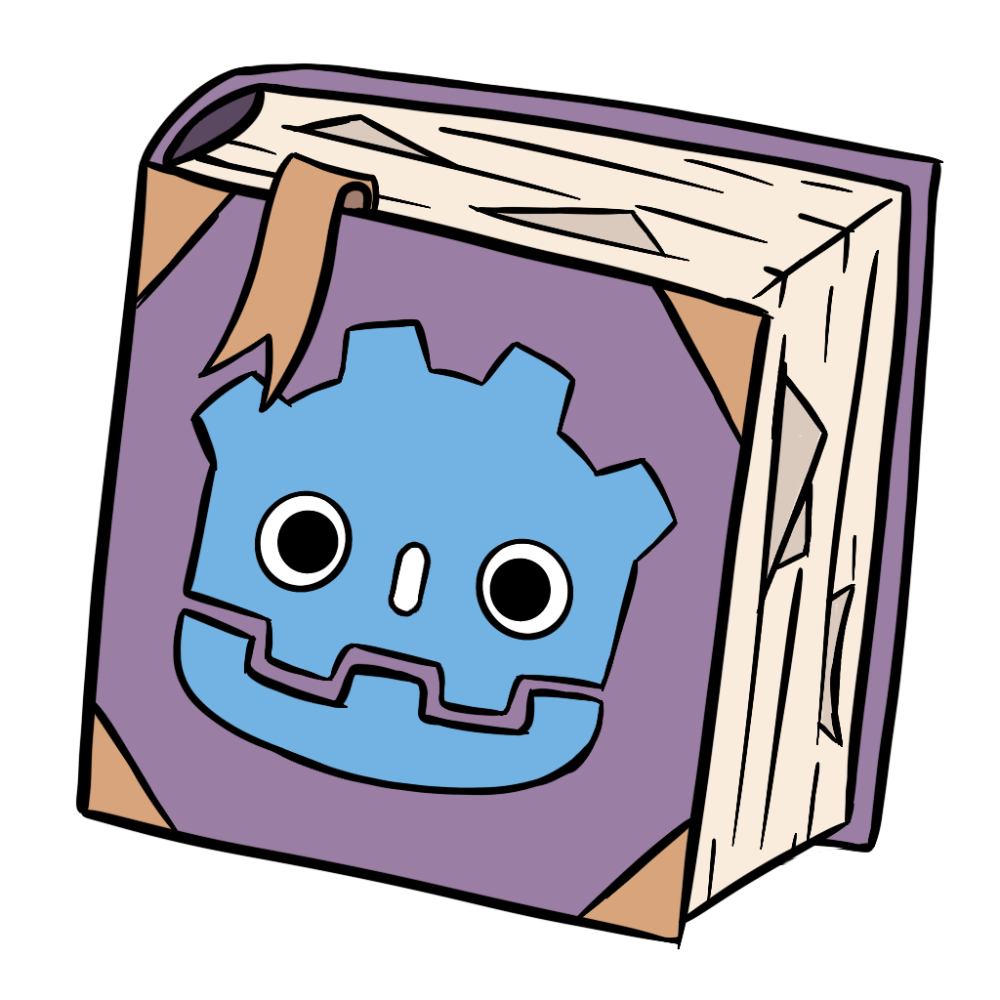

# Minoqis Utils for Godot

A utility library filled with commonly reused functions which help reduce duplicate code.

*NOTE: This is is for Godot 4.X*

## Features

- Recreations of Missing Unity Functions
- Functions for 2D movement
- Functions for 3D movement
- Functions for functions related to grids
- Functions for UI
- Functions for combat

## Installation

1. Copy the 'addons/minoqi_utils' directory into your 'res://addons/' directory.
2. This plugin works through a singleton script and is not an Autoload, therefore you shouldn't have to enable it. It should work by just typing **'MinoqisUtils.FUNCTION_NAME()'**.

## Documentation

- [GDScript](docs/GDScript.md)
- C# (Coming Soon)

## Updates

Stay up-to-date with the development of the project by checking either the **'issues tab'** or the **'projects'** tab and select **'Minoqis Utils Godot Tracker'**.

## Contributors

Minoqis Utils Godot is made by [Minoqi](https://github.com/Minoqi). Feel free to assist directly with the project by following the [Coding Standard](docs/CodingStandardGDScript.md) or by submitting an issue for either a desired feature or a bug. Please include as many details as possible, including any relevant screenshots/videos/gifs. You can help make the process faster by marking an issue as either an enhancement or bug (or another if appropriate).

## License

Licensed under the MIT license, see 'LICENSE' for more information.
